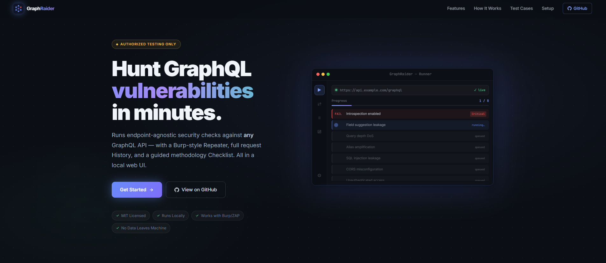

# ◆ GraphRaider

**A GraphQL security testing toolkit for pentesters.**

[](LICENSE)
[](https://github.com/Satyam9927/GraphRaider/actions/workflows/ci.yml)


[](.github/CONTRIBUTING.md)

GraphRaider runs a battery of endpoint-agnostic GraphQL security checks, gives you a
Burp-style **Repeater**, a full **request History**, and a manual **methodology checklist** -
all in a clean local web UI. It works against **any** GraphQL endpoint and routes cleanly
through Burp Suite / OWASP ZAP.

> ⚠️ **Authorized testing only.** Use GraphRaider exclusively against systems you own or are
> explicitly permitted to test.



---

## Features

| Tab | What it does |
|-----|--------------|
| **▶ Runner** | Automated, endpoint-agnostic test cases with a live, color-coded console, baseline reachability probe, per-test PASS/FAIL verdicts + confidence, progress tracking, and a **→ Repeater** button to push the test's request into the Repeater. |
| **⇄ Repeater** | Burp-style request editor - pick the method, attach **Session A / B / none**, edit headers + body, send through the (optional) proxy, and inspect the pretty-printed response. **Save** requests for reuse. |
| **≡ History** | Every request issued by the Runner and Repeater, with full request/response detail and **one-click Send to Repeater** to replay anything by hand. |
| **☑ Checklist** | A manual GraphQL pentest methodology checklist (OWASP API Top 10 / WSTG references) with per-item notes and live progress %. |
| **⚙ Settings** | Two sub-tabs - **Configuration** (endpoint, flexible auth, evaluation mode + API key) and **Proxy & Intercept** (Burp/ZAP routing). |

### The 3-agent framework
Every automated test runs through three cooperating agents:

1. **Agent 1 - Sender** issues the HTTP request and captures the raw result.
2. **Agent 2 - Validator** confirms the round-trip; on a transport failure it tells Agent 1 how to retry (double the timeout, drop TLS verification, back off).
3. **Agent 3 - Critic** turns the response into a **PASS (secure)** / **FAIL (vulnerable)** verdict with a confidence level and findings.

### Three evaluation modes
Selected in **Settings → Configuration → Evaluation mode**:

| Mode | Agent 1 | Agent 2 | Agent 3 (verdict) | API key | Best for |
|------|---------|---------|-------------------|---------|----------|
| **Rule-Based** | deterministic | deterministic | deterministic (status / regex / timing) | ❌ none | fast, fully offline runs |
| **Hybrid** | deterministic | deterministic | **Claude** writes the verdict | ✅ required | nuanced pass/fail reasoning |
| **Full Claude** | deterministic | **Claude**-assisted retry diagnosis | **Claude** writes the verdict | ✅ required | maximum LLM assistance |

> Hybrid / Full Claude call the Anthropic API (`claude-sonnet-4-6`) and need a key set in Settings.
> If a Claude call fails, the Critic automatically falls back to the rule-based verdict.

### Flexible authentication
Two independent sessions - **A** (primary) and **B** (secondary, for cross-session / BOLA tests).
Each picks one token type:

| Type | Fields | Sent as |
|------|--------|---------|
| **Bearer / JWT** | token (with live JWT decode + expiry preview) | `Authorization: Bearer <token>` |
| **Cookie** | cookie name + value | `Cookie: <name>=<value>` |
| **Custom Header** | header name + value | `<name>: <value>` (e.g. `X-API-Key`) |

### Configuration options (Settings)
| Option | Description |
|--------|-------------|
| **GraphQL Endpoint** | The single URL under test - used by all tests, the baseline probe, and the Repeater default. |
| **Session A / B** | Token type + credentials (see above). |
| **Evaluation mode** | Rule-Based / Hybrid / Full Claude (see table). |
| **Anthropic API key** | Required for Hybrid / Full Claude; stored only in your local `config.json`. |
| **Proxy enabled** | Routes Runner + Repeater traffic through an intercepting proxy (Burp / ZAP). |
| **Proxy URL** | Default `http://127.0.0.1:8080`; TLS verification auto-disabled while proxying. |

### Persistent memory
Your endpoint, sessions, results, console logs, request history, saved Repeater requests, and
checklist state (incl. notes) are saved to `storage/config.json` automatically and restored on
next launch. That file is **git-ignored** because it contains tokens / cookies / API keys.

### Built-in test cases
16 endpoint-agnostic cases - they rely only on universal GraphQL features (`__typename`,
introspection, aliasing, batching, GET transport) so they run schema-blind against any server:

| ID | Category | Checks |
|----|----------|--------|
| `TC-DISC-01` | Discovery | Introspection enabled / schema downloadable |
| `TC-DISC-02` | Discovery | Field-suggestion ("Did you mean") leakage |
| `TC-DOS-01` | Denial of Service | Query depth / complexity limit |
| `TC-DOS-02` | Denial of Service | Alias-based amplification |
| `TC-DOS-03` | Denial of Service | Array query batching |
| `TC-INFO-01` | Information Disclosure | Verbose errors / stack-trace leakage |
| `TC-INJ-01` | Injection | SQL injection error leakage (best-effort) |
| `TC-INJ-02` | Injection | NoSQL / operator injection leakage (best-effort) |
| `TC-CSRF-01` | CSRF | Query execution over GET |
| `TC-CSRF-02` | CSRF | Form-encoded content-type accepted |
| `TC-TLS-01` | Transport | Security headers (HSTS, X-CTO, banners) |
| `TC-TLS-02` | Transport | CORS misconfiguration |
| `TC-AUTH-01` | Authentication | Unauthenticated access |
| `TC-AUTH-02` | Authentication | Tampered / `alg=none` token *(needs JWT bearer session)* |
| `TC-AUTH-03` | Authentication | Expired token accepted *(needs JWT bearer session)* |
| `TC-AUTHZ-01` | Authorization | Cross-session isolation / BOLA harness *(needs Session B)* |

Endpoint-specific tests (BOLA on a known object, mass-assignment on a known mutation, …) are
best crafted by hand in the **Repeater** - use the Checklist tab as your methodology guide.

---

## Requirements
- **Python 3.10+**
- **Node.js 18+**

---

## Setup - Windows

```powershell
# from the GraphRaider folder
.\start.ps1
```

`start.ps1` will:
1. Create `storage/config.json` from `storage/config.example.json` if it doesn't exist.
2. Create a Python virtualenv (`venv/`) and install backend deps.
3. Install the frontend's Node deps.
4. Launch the backend (`:8000`) and frontend (`:3000`) in separate windows.
5. Open `http://localhost:3000` in your browser.

To stop:
```powershell
.\kill.ps1
```

> If you get *"running scripts is disabled on this system"*, allow local scripts for your user:
> ```powershell
> Set-ExecutionPolicy -Scope CurrentUser RemoteSigned
> ```

---

## Setup - macOS / Linux

```bash
# from the GraphRaider folder
chmod +x start.sh kill.sh   # first time only
./start.sh
```

`start.sh` performs the same steps as the Windows script (config bootstrap, venv, deps,
launch, open browser). Press **Ctrl+C** in the terminal to stop both services, or:
```bash
./kill.sh
```

> macOS browser open uses `open`; Linux uses `xdg-open`.

---

## Setup - Docker

Run the whole tool (backend + frontend) in one container - no local Python or Node needed.

```bash
# from the GraphRaider folder
docker compose up --build
```

Then open **http://localhost:3000**. To stop: `docker compose down` (add `-v` to also wipe the saved config volume).

What the container does:
- Bundles the FastAPI backend (`:8000`) and the Express frontend (`:3000`) in a single image and runs both.
- Bootstraps `config.json` on first start from the example.
- Persists your config + request log in a named volume (`graphraider-data`), so settings survive restarts.

Plain Docker (no compose):
```bash
docker build -t graphraider .
docker run --rm -p 3000:3000 -p 8000:8000 -v graphraider-data:/data graphraider
```

> Both ports are published to the host because the browser talks to the API/WebSocket on
> `localhost:8000` directly. Run it on your own machine (as you would any local pentest tool);
> if you run it on a remote host, tunnel both ports back to your workstation.

---

## First run

`http://localhost:3000` opens the **landing page**. Click **Get Started** (or go straight to
**http://localhost:3000/dashboard**) to launch the tool. The dashboard logo links back to the landing page.

1. Open **⚙ Settings → Configuration**.
2. Set the **GraphQL Endpoint** (e.g. `https://target.example.com/graphql`).
3. Configure **Session A** - choose **Bearer/JWT**, **Cookie**, or **Custom Header** and fill in the credential.
   (Optionally configure **Session B** for cross-session / BOLA tests.)
4. Pick an **Evaluation mode** - **Rule-Based** (default, no key) or **Hybrid / Full Claude** (add an Anthropic API key for Claude-assisted verdicts).
5. **Save Configuration.**
6. Go to **▶ Runner**, select a test case (or **Run All**), and watch the live console.

### Routing through Burp / ZAP
**⚙ Settings → Proxy & Intercept** → enable the toggle and set the proxy URL
(default `http://127.0.0.1:8080`). TLS verification is disabled automatically while proxying,
so no CA import is needed - every request shows up in your proxy's HTTP history.

---

## Project layout

```
GraphRaider/
├── start.ps1 / kill.ps1        # Windows launchers
├── start.sh  / kill.sh         # macOS / Linux launchers
├── Dockerfile                  # single image: backend + frontend
├── docker-entrypoint.sh        # runs both services, bootstraps config
├── docker-compose.yml          # one-command run + persistent volume
├── .dockerignore
├── .gitignore
├── LICENSE · CHANGELOG.md
├── .github/                    # CONTRIBUTING, SECURITY, CI, issue/PR templates
├── storage/                    # persisted state (see below)
│   ├── config.example.json     # template - copied to config.json on first start
│   ├── config.json             # YOUR settings + tokens (git-ignored, auto-created)
│   └── request_log.json        # request log (git-ignored, auto-created)
├── backend/
│   ├── main.py                 # FastAPI + WebSocket runner, repeater + config endpoints
│   ├── agents.py               # 3-agent framework (Sender / Validator / Critic)
│   ├── test_cases.py           # generic, endpoint-agnostic GraphQL test cases
│   ├── jwt_utils.py            # JWT decode / tamper helpers
│   ├── proxy_log.py            # request log writer
│   └── requirements.txt
└── frontend/
    ├── server.js               # static Express server (landing at /, app at /dashboard)
    ├── package.json
    └── public/                 # landing.html · index.html (app) · app.js · styles.css · favicon.svg
```

All writable state lives in **`storage/`** (override with the `GRAPHRAIDER_CONFIG` /
`GRAPHRAIDER_LOG` env vars; Docker points these at a mounted volume). Only
`storage/config.example.json` is committed - your real `config.json` and `request_log.json`
are git-ignored.

---

## Extending the test suite
Add a case to `backend/test_cases.py` (`id`, `name`, `category`, `refs`, a `build_requests(config)`
function returning request dicts), then add a matching verdict branch in `RuleAgent3.evaluate`
in `backend/agents.py`. The UI picks it up automatically on the next backend restart.

## License
MIT. Contributions welcome - this is meant to be a community pentest tool.
